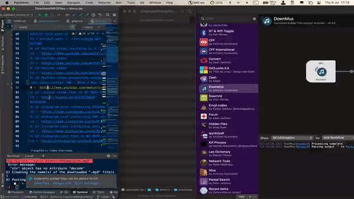

# dmus.py<!-- omit in toc -->

Python program that automatically retrieves the ".mp3" audio file from a URL or
a ".mp4" video file path saved in the clipboard or provided as a command line
argument.

## Table of contents<!-- omit in toc -->

- [1. Description](#1-description)
- [2. Getting started](#2-getting-started)
  - [2.1 Dependencies](#21-dependencies)
  - [2.2 Installing](#22-installing)
  - [2.3 Executing program](#23-executing-program)
- [3. Version history](#3-version-history)

<!-- toc -->

## 1. Description

`dmus.py` is a Python program that allows to extract the audio file of a video
providing either the video URL or the video absolute file path.
The software leverages `youtube-dl` (the open-source download manager for video
and audio from YouTube). It might work with pretty much all kind of platforms,
but currently supports videos hosted on at least following platforms:

- YouTube
- Instagram

In case a video doesn't come from one of the above-mentioned websites, the
program might not work properly, and the ".mp3" audio file might not be
retrieved.

\
Important point to notice:

- In the case of a ".mp3" audio file extracted from a video accessible via its
  URL, the URL in question is copied to the "Comments" section of the ".mp3"
  audio file meta information.

- The `DownMus` Alfred workflow implements the `dmus.py` Python program. After
  installing the [Alfred macOS app](https://www.alfredapp.com) and the `DownMus`
  workflow, simply copy a video path or URL to the clipboard and then type the
  `dm` hotkey in the Alfred search bar. The `dmus.py` Python program is then
  automatically triggered and runs in iTerm2.
  

	

## 2. Getting started

### 2.1 Dependencies

- Tested on macOS Big Sur version 11.4
- Python 2.7

### 2.2 Installing

`pip install -r requirements.txt`

### 2.3 Executing program

- To access useful help messages, type following Terminal command at the root of
  the project:
  
  `/usr/local/bin/python2.7 dmus.py -h`

- To retrieve a single ".mp3" audio file from a video URL or a video file path
  saved in the clipboard, type following command at the root of the project:
  
  `/usr/local/bin/python2.7 dmus.py`

  The program will automatically get the clipboard stored video URL or video
  file path and extract its attached ".mp3" audio file.

- To retrieve a single ".mp3" audio file from a video URL or a video file path
  provided as a command line argument, type following Terminal command at the
  root of the project:
  
  `/usr/local/bin/python2.7 dmus.py --vid /my/video/url/or/file/path`

  The program will automatically use the video URL or video file path and
  extract its attached ".mp3" audio file.

Remark: ~~with a Bash Terminal window, `/usr/local/bin/python2.7` can simply be
replaced by `python`~~ ← This trick only worked up to macOS Monterey Version 12.3.1 ⚠️

## 3. Version history

- 0.1
  - Initial release
